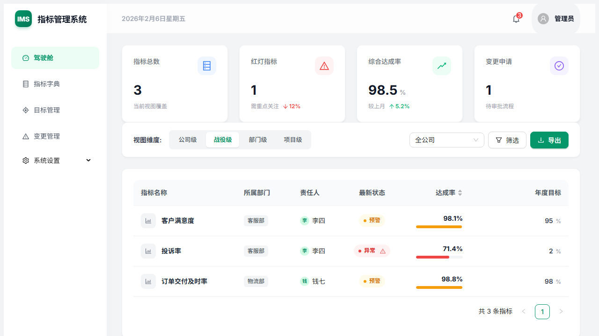

# DST 指标管理系统 (Indicator Management System)

一款商用级架构的现代化指标管理系统前端界面，基于 React 19 + Ant Design 6 + ECharts 构建。
本项目针对静态托管进行了深度优化，支持 GitHub Pages、Cloudflare Pages 以及离线单文件运行。



## 🌟 核心特性 (IMS 2.0 Redesign)

- **现代化仪表盘**: 自定义 StatCard 布局，集成业务趋势与核心指标分析。
- **高识别度状态**: 引入胶囊化 (Capsule) 状态标签，带有实时红绿灯预警。
- **可视化达成率**: 列表集成进度条展示，直观对比年度目标与实际值。
- **商用美观度**: 全新 Emerald 绿配色系统，优化字体层级与间距。
- **全流程覆盖**: 包含驾驶舱、指标字典、目标录入、变更审批等核心模块。
- **极致部署体验**:
  - **离线单文件**: 编译生成单一 HTML 文件，零依赖，直接双击运行。
  - **静态路由**: 使用 `HashRouter`，兼容所有静态托管服务。

## 🛠 技术栈

- **构建工具**: Vite 7
- **框架**: React 19
- **UI 组件库**: Ant Design 6.x
- **图表库**: ECharts (echarts-for-react)
- **路由**: React Router v7 (HashRouter)
- **打包插件**: vite-plugin-singlefile (实现单文件内联)

## 🚀 快速启动

```bash
# 安装依赖
npm install

# 启动开发服务器
npm run dev
```

## 📦 打包与部署

### 1. 离线单文件打包 (推荐用于发送给同事)

本项目已配置 `vite-plugin-singlefile`，构建结果会将所有 JS/CSS 内联到一个 HTML 文件中。

```bash
npm run build
```

打包完成后，`dist/index.html` 即为最终产物。**直接双击打开即可，无需 Web 服务器。**

### 2. 在线部署 (GitHub Pages)

本项目已配置 GitHub Actions (`.github/workflows/deploy.yml`)。

- **GitHub Pages**: 代码推送到 `main` 分支后自动构建部署。
  - 访问地址: [https://maxthonzx.github.io/target/](https://maxthonzx.github.io/target/)

## 📂 项目结构

```
src/
├── assets/          # 静态资源
├── layouts/         # 页面布局 (MainLayout)
├── pages/           # 业务页面
│   ├── Dashboard/          # 驾驶舱
│   ├── IndicatorList/      # 指标列表
│   ├── TargetManagement/   # 目标管理
│   └── ChangeManagement/   # 变更管理
├── theme/           # Ant Design 主题配置
├── App.jsx          # 路由配置
└── main.jsx         # 入口文件
```

---
*Created with ❤️ by Antigravity*
